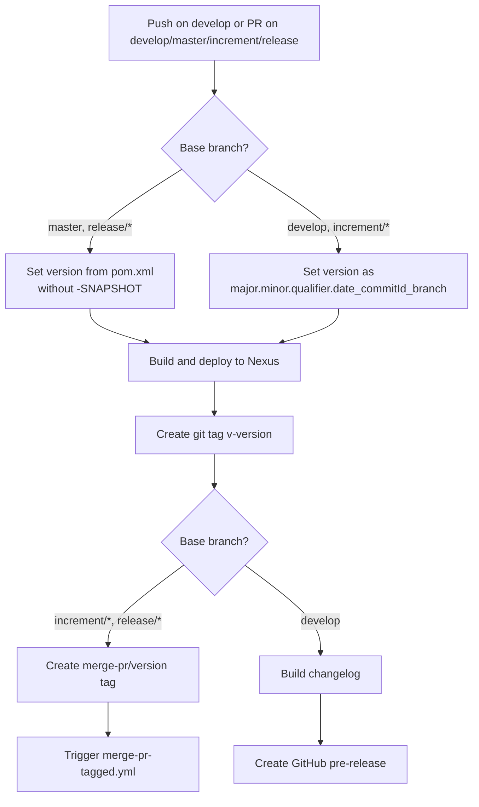
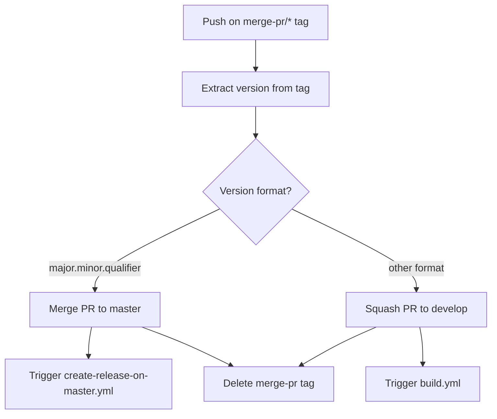
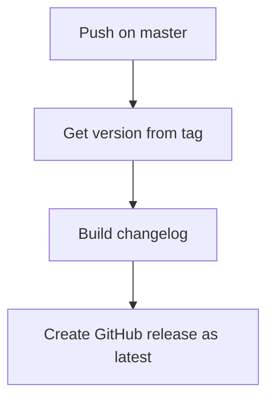
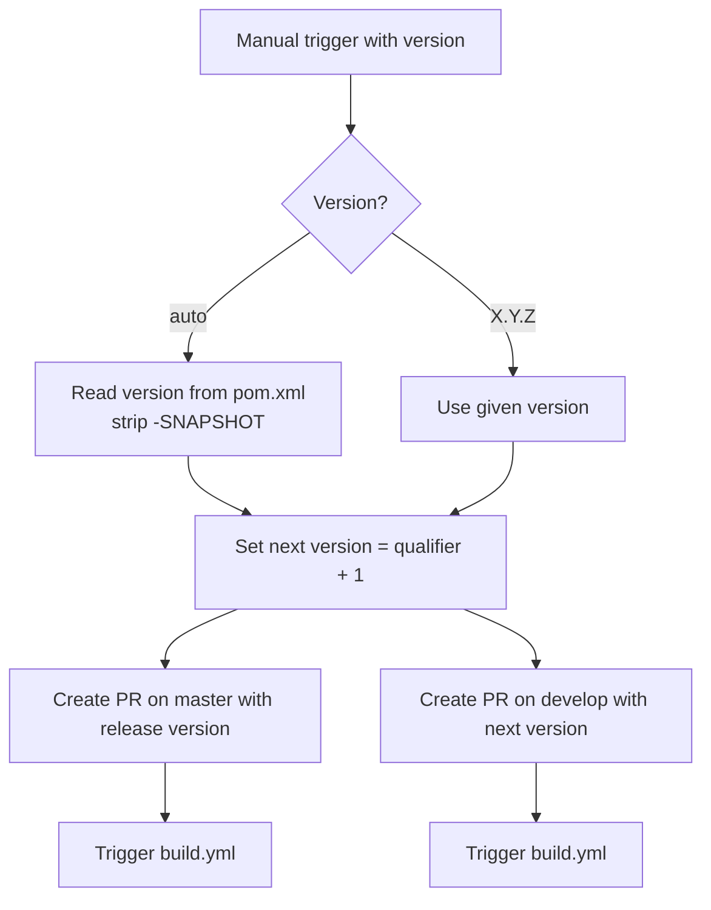

# Development Version and Branch Handling

This document describes the Git branching strategy, version numbering policy, and CI/CD workflows used by the JUDO Generator Commons project. The branching model is based on [GitFlow](https://www.atlassian.com/git/tutorials/comparing-workflows/gitflow-workflow).

## Branches

The repository uses the following branch types:

| Branch Pattern | Purpose | Base Branch |
|---------------|---------|-------------|
| `develop` | Active development; contains the latest sources for the current version | -- |
| `feature/JNG-NUMBER_short_summary` | New features to be included in the current version | `develop` |
| `release/X.Y.Z` (or `X_Y_Z`) | Release stabilization and testing | `develop` |
| `bugfix/JNG-NUMBER_short_summary` | Bug fixes applied during release testing | release branch |
| `support/JNG-NUMBER_short_summary` | Minor changes for a previous release | release branch |
| `master` | Latest released sources | release branch (via merge) |
| `hotfix/JNG-NUMBER_short_summary` | Urgent fixes applied to both master and develop | `master` |

### Branch Lifecycle

```mermaid
gitGraph
    commit id: "initial"
    branch develop
    checkout develop
    commit id: "dev-1"
    branch feature/JNG-1
    checkout feature/JNG-1
    commit id: "feat-1"
    commit id: "feat-2"
    checkout develop
    merge feature/JNG-1 id: "merge-feat-1"
    branch feature/JNG-2
    checkout feature/JNG-2
    commit id: "feat-3"
    checkout develop
    merge feature/JNG-2 id: "merge-feat-2"
    branch release/1.0-beta1
    checkout release/1.0-beta1
    commit id: "stabilize"
    branch bugfix/JNG-4
    checkout bugfix/JNG-4
    commit id: "fix-1"
    checkout release/1.0-beta1
    merge bugfix/JNG-4 id: "merge-fix"
    checkout master
    merge release/1.0-beta1 id: "release-1.0"
    checkout develop
    merge release/1.0-beta1 id: "back-merge"
```

## Version Numbers

Version numbers follow semantic versioning with these rules:

| Event | Version Change | Example |
|-------|---------------|---------|
| Start a **feature** branch | No change | `1.0.0-SNAPSHOT` stays |
| Start a **release** branch | Increment 2nd number on `develop` | `develop` becomes `1.1.0-SNAPSHOT` |
| Start a **bugfix** branch | No change | Applied on release branch as-is |
| Start a **support** branch | Increment 3rd number | `1.0.1-SNAPSHOT` |
| Start a **hotfix** branch | Increment 4th number | `1.0.0.1-SNAPSHOT` |

## GitHub Action Workflows

The project uses several GitHub Actions workflows that automate building, testing, releasing, and merging.

### build.yml

Triggered on pushes to `develop` and pull requests targeting `develop`, `master`, `increment/*`, or `release/*` branches.



### merge-pr-tagged.yml

Triggered when a `merge-pr/*` tag is pushed. Handles merging PRs to the correct branch based on version format.



### create-release-on-master.yml

Triggered on pushes to `master`. Creates a final GitHub release with a changelog.



### release.yml

Manually triggered with a version parameter. Creates release and version-bump pull requests.



## Development Rules

> **Important:** There is no commit without a JIRA ticket number. Every pull request and commit must reference a `JNG-xxx` ticket.

For issue tracking, the project uses [JIRA](https://blackbelt.atlassian.net/jira/dashboards).
