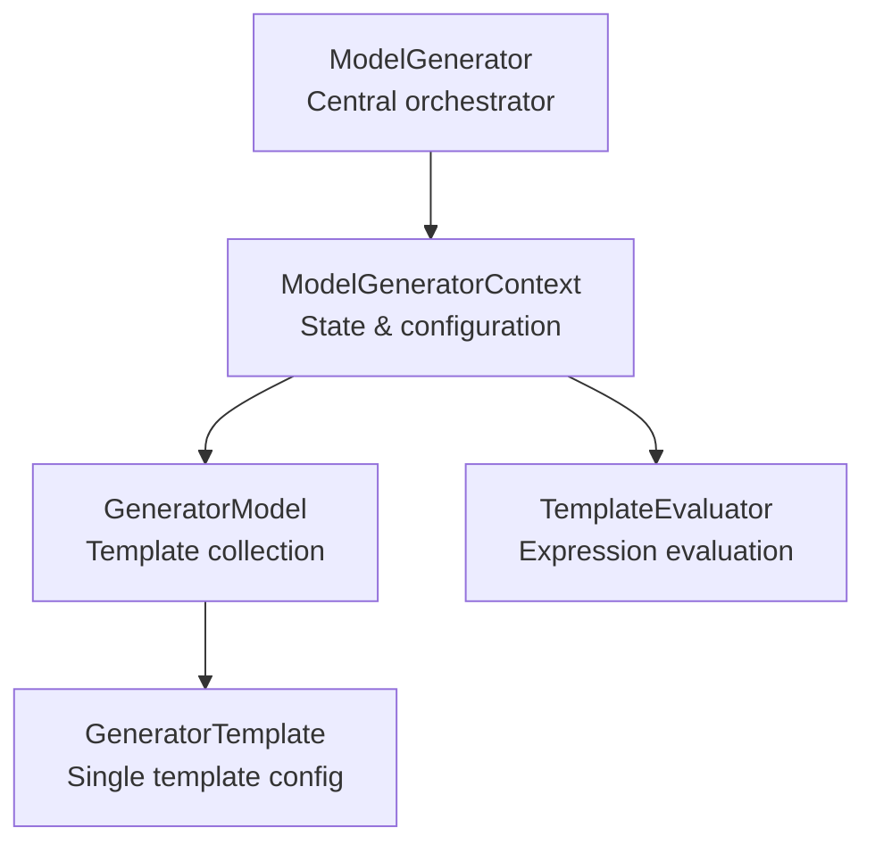
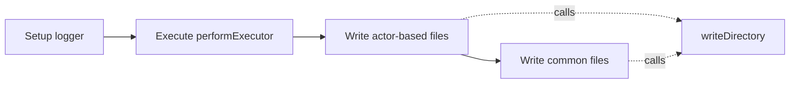
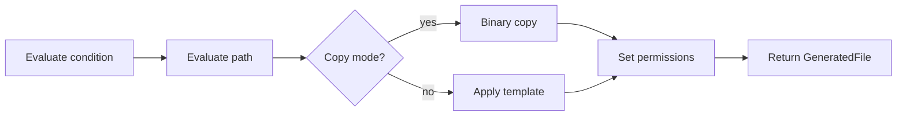
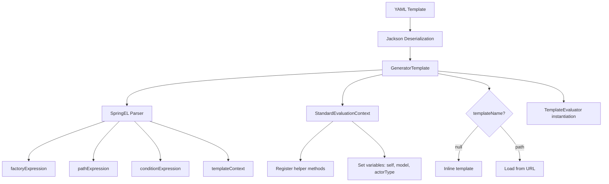
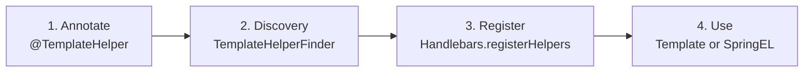

# JUDO Generator Commons - AI Agent Instructions

This document provides comprehensive guidance for AI coding assistants working on the JUDO Generator Commons project.

## Project Overview


**JUDO Generator Commons** is a template-based code generation framework that transforms meta-models into code using Handlebars templates and SpringEL expressions. It provides a robust foundation for generator engine development with features like checksum validation, generator ignore patterns, and incremental generation.

### Key Facts
- **Language**: Java 21
- **Build Tool**: Maven 3.9.4
- **Packaging**: OSGi Bundle
- **Main Technologies**: Handlebars 4.4.0, Spring Expression 6.2.7, Jackson YAML 2.17.2
- **Repository**: https://github.com/BlackBeltTechnology/judo-generator-commons
- **License**: Eclipse Public License 2.0

### Meta-Models Using This Framework
- judo-meta-esm (ESM Generator)
- judo-meta-pam (PSM Generator)  
- judo-meta-ui (UI Generator)

Each meta-model has three related modules:
1. `generator-engine` - Configures generation process, binds meta-model
2. `generator-maven-project` - Maven project descriptor
3. `generator-maven-plugin-test` - Test project examples

## Code Instructions

1. First think through the problem, read the codebase for relevant files.
2. Before you make any major changes, check in with me and I will verify the plan.
3. Please every step of the way just give me a high level explanation of what changes you made.
4. Make every task and code change you do as simple as possible. We want to avoid making any massive or complex changes. Every change should impact as little code as possible. Everything is about simplicity.
5. Maintain a documentation file that describes how the architecture of the app works inside and out.
6. Never speculate about code you have not opened. If the user references a specific file, you MUST read the file before answering. Make sure to investigate and read relevant files BEFORE answering questions about the codebase. Never make any claims about code before investigating unless you are certain of the correct answer - give grounded and hallucination-free answers.
7. For implementation use TDD (Test-Driven Development): write or update tests first to define the expected behaviour, verify they fail, then write the minimal implementation to make them pass.
8. Use DRY (Don't Repeat Yourself): extract reusable logic into separate classes, utilities, or components. If the same pattern appears in multiple places, refactor it into a shared helper.

## Architecture Overview

### Core Components



**ModelGenerator** - Central orchestrator with methods: `generateToDirectory()`, `resetChecksums()`, `recalculateChecksumToDirectory()`, `cleanGeneratedFromChecksum()`

**ModelGeneratorContext** - State management: Handlebars engine, SpringEL context, helper registration, value resolvers

**GeneratorModel** - Template collection: YAML deserialization, override mechanism, global config

**TemplateEvaluator** - Expression evaluation: factory, path, and condition expressions

**GeneratorTemplate** - Single template config: pathExpression, factoryExpression, conditionExpression, templateContext, actorTypeBased, permissions

### Design Patterns

1. **Builder Pattern**: Used extensively for configuration objects
   - `GeneratorParameter`, `GeneratorModel`, `GeneratorTemplate`
   - `GeneratedFile`, `GeneratorFileEntry`, `GeneratorResult`

2. **Strategy Pattern**: Function-based extensibility
   - `targetDirectoryResolver`: Function<?, File>
   - `performExecutor`: Function<GeneratorParameter, GeneratorResult>
   - Custom directory/name resolvers

3. **Template Method**: Static methods in ModelGenerator define workflow
   - `generateToDirectory()` - main entry point
   - `writeDirectory()` - file writing logic
   - `getDirectoryWriter()` - factory for Consumer

4. **Factory Pattern**: Context and component creation
   - `createGeneratorContext()` - builds context with helpers
   - `generatorModelBuilder()` - YAML-based model factory

5. **Value Object Pattern**: Immutable data carriers
   - `GeneratedFile`, `GeneratorFileEntry`

## Generation Workflow

### Complete Flow

**1. ModelGenerator.generateToDirectory(GeneratorParameter)**



---

**2. writeDirectory()**


---

**3. generateFile()**



### Expression Evaluation Sequence

**Initialization Phase**



---

**Runtime Phase (generateFile)**


## Key Files Reference

### Core Generation (`src/main/java/hu/blackbelt/judo/generator/commons/`)

| File | Lines | Purpose | Key Methods |
|------|-------|---------|-------------|
| `ModelGenerator.java` | 1-450 | Central orchestrator | `generateToDirectory()`, `writeDirectory()`, `resetChecksums()` |
| `ModelGeneratorContext.java` | 1-95 | State container | `createHandlebars()`, `createSpringEvaluationContext()` |
| `GeneratorModel.java` | 1-70 | Template collection | `loadYamlURL()`, `overrideTemplates()` |
| `GeneratorTemplate.java` | 1-110 | Single template config | `evalToContextBuilder()` |
| `TemplateEvaulator.java` | 1-65 | Expression evaluator | `getFactoryExpressionResultOrValue()` |
| `GeneratorParameter.java` | 1-40 | Configuration builder | Builder pattern fields |

### Template System

| File | Lines | Purpose |
|------|-------|---------|
| `ChainedURLTemplateLoader.java` | 1-210 | Template loading with override | 
| `TemplateHelperFinder.java` | 1-80 | Helper class discovery via annotations |
| `StaticMethodValueResolver.java` | 1-85 | Base for helper classes |
| `ThreadLocalContextHolder.java` | 1-45 | Context access for helpers |
| `TemplateSpringELExpression.java` | 1-35 | Expression POJO |

### Utilities

| File | Lines | Purpose |
|------|-------|---------|
| `ChecksumUtil.java` | 1-55 | MD5 hash calculation |
| `GeneratorIgnore.java` | 1-110 | GLOB-based file exclusion |
| `ChecksumIgnore.java` | 1-110 | Checksum validation override |
| `GitIgnoreSynchronizer.java` | 1-130 | Maintains .gitignore with markers |
| `UriHelper.java` | 1-55 | URI manipulation utilities |
| `StringHelper.java` | 1-80 | String transformation helpers |

### Data Models

| File | Purpose |
|------|---------|
| `GeneratedFile.java` | Single generated file (path, content, permissions) |
| `GeneratorFileEntry.java` | Persisted entry (path, checksum) |
| `GeneratorResult.java` | Generation result container |

### Annotations (`annotations/`)

| Annotation | Purpose |
|------------|---------|
| `@TemplateHelper` | Mark helper classes for discovery |
| `@ContextAccessor` | Signal bindContext(Map) availability |

## Template System Deep Dive

### Handlebars Integration

**Configuration** (`ModelGeneratorContext.createHandlebars()`:77-95):
- UTF-8 charset
- HighConcurrencyTemplateCache
- Conditional and String helpers built-in
- Custom "times" helper for iteration
- All registered helper classes
- Pretty printing enabled
- Infinite loops allowed

### Helper System

#### Registration Flow



**Step 1 - Annotate**: Add `@TemplateHelper`, extend `StaticMethodValueResolver`, create public static methods

**Step 2 - Discovery**: `TemplateHelperFinder` scans classpath using ClassGraph with package filtering

**Step 3 - Registration**: Added to `ModelGeneratorContext.helpers`, registered with Handlebars

**Step 4 - Usage**: In templates `{{myMethod value}}` or SpringEL `#myMethod(value)`

#### Helper Requirements

**MUST:**
- Be public static methods
- Have 0 or 1 parameter
- Return non-void
- Be in @TemplateHelper annotated class

**SHOULD:**
- Extend StaticMethodValueResolver for method caching
- Use ThreadLocalContextHolder for template parameters access

#### Example Helper

```java
@TemplateHelper
public class StringHelper extends StaticMethodValueResolver {
    
    public static String upperCase(Object obj) {
        return obj != null ? obj.toString().toUpperCase() : "";
    }
    
    public static String camelCaseToSnakeCase(Object obj) {
        return CaseFormat.LOWER_CAMEL.to(CaseFormat.LOWER_UNDERSCORE, 
                                         obj.toString());
    }
}
```

### Context Access in Helpers

For accessing template parameters in parallel builds:

```java
@TemplateHelper
@ContextAccessor
public class ConfigHelper extends StaticMethodValueResolver {
    
    public static void bindContext(Map<String, ?> context) {
        ThreadLocalContextHolder.bindContext(context);
    }
    
    public static synchronized String getApiPrefix(Object obj) {
        return (String) ThreadLocalContextHolder.getVariable("apiPrefix");
    }
}
```

**Why needed**: Helpers are static, called from parallel processes. Template parameters are non-static. ThreadLocal provides thread-safe access.

### Template Loading

**ChainedURLTemplateLoader** features:
- Parent-child chain for fallback
- Override mechanism: `.override.hbs` takes precedence
- Path ordering prevents infinite loops
- URL-based resource loading

Example:
```
base/templates/actor.hbs        → Original template
override/templates/actor.override.hbs → Override (used if exists)
```

## YAML Template Descriptor

### Structure

```yaml
# Global permissions (optional)
permission: rwxr-xr-x

# Global template context (optional)
templateContext:
  - name: globalVar
    expression: "#someExpression"

templates:
  - name: templateId
    pathExpression: "#actorType.name + '/Actor.java'"
    templateName: templates/Actor.java.hbs
    actorTypeBased: true
    permission: rw-r--r--
    conditionExpression: "#actorType.isPublic()"
    factoryExpression: "#model.getAllActors()"
    templateContext:
      - name: localVar
        expression: "#self.getSomething()"
    copy: false
    exclude: false
```

### Properties

| Property | Type | Required | Description |
|----------|------|----------|-------------|
| `name` | String | Yes | Unique template identifier (for overrides) |
| `pathExpression` | SpringEL | Yes | Evaluates to output file path |
| `templateName` | String | No | Handlebars template path (null for inline) |
| `actorTypeBased` | Boolean | No | Iterate over actor types (default: false) |
| `factoryExpression` | SpringEL | No | Returns collection to iterate |
| `conditionExpression` | SpringEL | No | Boolean; skip if false |
| `templateContext` | List | No | Extra variables for template |
| `permission` | String | No | POSIX permissions (rwxrwxrwx) |
| `copy` | Boolean | No | Binary copy mode (default: false) |
| `exclude` | Boolean | No | Exclude from generation (override only) |

### Expression Context Variables

#### Always Available
- `#self` - Context-dependent (see below)
- `#model` - The model object from GeneratorParameter

#### When actorTypeBased=true
- `#actorType` - Current actor type
- `#self` - Same as #actorType

#### In factoryExpression context
- `#self` - Current iteration element

#### Custom Variables
- Any helper static method via `#methodName()`
- Template context expressions via configured names

### Self Meaning Matrix

| Situation | `#self` refers to |
|-----------|------------------|
| actorTypeBased=true | Current actor type |
| In factoryExpression iteration | Current collection element |
| Neither of above | The model |

## Key Features

### 1. Generator Ignore

**Purpose**: Prevent overwriting developer-modified files

**File**: `.generator-ignore` (at root or subdirectories)

**Format**: GLOB patterns (same as .gitignore)

**Examples**:
```
# Ignore specific file
src/main/CustomFile.java

# Ignore pattern
**/*.php
*.log

# Ignore directory
target/
docs/**

# Exception pattern
generated/*
!generated/important.txt
```

**Implementation** (`GeneratorIgnore.java`):
- LoadingCache with 200-entry maximum
- Walks directory tree upwards
- Combines patterns from all levels
- Method: `shouldExcludeFile(Path) → boolean`

**Behavior**:
- File still in index (.generated-files)
- Checksum checks still performed
- File writing skipped

### 2. Checksum Validation

**Purpose**: Detect manual modifications, prevent accidental overwrites

**Files**:
- `.generated-files` - All non-actor files
- `.generated-files-[actor]` - Actor-specific files

**Format**: `path,md5checksum`

**Workflow**:
```
1. Read saved checksums from .generated-files
2. Calculate current filesystem checksums
3. Compare:
   - Match → File unchanged, may skip write
   - Mismatch → File manually modified
     - If in .generator-checksum-ignore → Write anyway
     - Else → Error: "Generated file modified"
4. Write new checksums to .generated-files
```

**Checksum Ignore** (`.generator-checksum-ignore`):
- Same GLOB format as .generator-ignore
- Allows overwriting manually modified files
- Use case: Intentional manual edits

**Implementation** (`ChecksumUtil.java`):
- MD5 hash via MessageDigest
- Streaming calculation with DigestInputStream
- Zero-padded 32-character hex string

### 3. Permission Management

**Format**: POSIX `rwxrwxrwx` (read, write, execute)
- Owner (3 chars), Group (3 chars), Other (3 chars)
- Example: `rwxr-xr-x` = Owner:rwx, Group:r-x, Other:r-x

**Precedence**:
1. Template-level permission (in YAML)
2. Model-level global permission
3. No permission set (null)

**Implementation** (`ModelGenerator.writeFile()`:241-275):
- Sets POSIX permissions if supported
- Fallback for non-POSIX systems (Windows)
- Creates parent directories automatically

### 4. Whitespace-Tolerant Comparison

**Purpose**: Detect semantically equivalent files despite formatting differences

**Problem**: Code formatters (Prettier, IDE auto-format) modify generated files, causing false checksum mismatches when builds fail before checksum regeneration.

**Configuration** (in generator model YAML):
```yaml
fileNormalizers:
  # Auto-detect all supported languages
  - preset: auto
  
  # Or specific presets
  - preset: java
  - preset: ts
  
  # Or custom configuration
  - extensions: [java, kt]
    removeDoubleSpaces: true
    removeTabs: true
    patterns:
      - pattern: "^import\\s+.*?;\\s*$"
        flags: [MULTILINE]
```

**Built-in Presets**:
| Preset | Extensions | Description |
|--------|------------|-------------|
| `auto` | All below | Auto-detect by extension |
| `java` | .java | Remove imports, collapse whitespace |
| `ts` | .ts, .tsx | Remove imports, collapse whitespace |
| `js` | .js, .jsx, .mjs, .cjs | Remove imports, collapse whitespace |
| `rust` | .rs | Remove use statements, collapse whitespace |
| `go` | .go | Remove imports, collapse whitespace |
| `python` | .py | Remove imports, collapse whitespace |

**Normalization Order**:
1. Line endings: CRLF → LF (always)
2. Boolean flags: tabs → double spaces → newlines
3. Custom regex patterns (in configured order)

**Workflow**:
```
1. Checksum mismatch detected
2. If normalizer configured for file extension:
   a. Load filesystem and generated content
   b. Apply normalizations to both
   c. Compare normalized content
   d. If equal: keep file, update checksum (INFO log)
   e. If different: proceed with normal validation
3. If no normalizer: use standard checksum validation
```

**Implementation Files**:
- `NormalizerPattern.java` - Regex pattern with flags
- `FileTypeNormalizer.java` - Per-extension normalizer config
- `FileNormalizerRegistry.java` - Registry by extension
- `ContentComparator.java` - Normalized comparison utility
- `NormalizerPresets.java` - Built-in preset definitions

**Logging**: INFO level when checksum auto-updated
```
INFO: File 'Foo.java' has equivalent normalized content, updating checksum
```

### 5. GitIgnore Synchronization

**Purpose**: Auto-update .gitignore with generated files

**File**: `.gitignore`

**Markers**:
```
# JUDO GENERATOR BLOCK START
/generated/file1.java
/generated/file2.java
# JUDO GENERATOR BLOCK END
```

**Implementation** (`GitIgnoreSynchronizer.java`):
- Preserves existing .gitignore content
- Replaces only JUDO block
- Adds block if not present
- Method: `addGeneratedFiles(Collection<GeneratorFileEntry>)`

### 6. SpringEL Expression System

**Engine**: Spring Expression Language 6.2.7

**Features**:
- Property access: `#model.name`
- Method calls: `#actorType.getFullName()`
- Operators: `+`, `-`, `&&`, `||`, `!`
- Ternary: `#condition ? 'yes' : 'no'`
- Collections: `#list.![property]`, `#list.?[condition]`

**Helper Integration**:
```java
// In ModelGeneratorContext.createSpringEvaluationContext()
for (Method method : helperMethods) {
    context.registerFunction(methodName, method);
}

// In YAML
pathExpression: "#upperCase(#actorType.name) + '.java'"
```

**Evaluation Context** (`StandardEvaluationContext`):
- Variables set from GeneratorParameter
- Helper static methods registered as functions
- Root object varies (self, model, actorType)

## Testing Strategy

### Test Files

| File | Tests | Coverage |
|------|-------|----------|
| `ModelGeneratorTest.java` | 9 tests | File writing, checksums, ignore, gitignore |
| `GeneratorIgnoreTest.java` | 6 tests | GLOB pattern matching, hierarchy |
| `ChecksumIgnoreTest.java` | 6 tests | Checksum ignore patterns |

### Testing Patterns

1. **JUnit 5** (Jupiter) with `@Test` annotations
2. **Hamcrest matchers** for assertions
3. **Temporary directories** via `Files.createTempDirectory()`
4. **Guava ImmutableList** for test data
5. **@BeforeEach** for fixture setup

### Example Test Structure

```java
@Test
public void testFeature() throws Exception {
    // Arrange
    Path tempDir = Files.createTempDirectory("testPrefix");
    GeneratorParameter param = GeneratorParameter.builder()
        .targetDirectory(tempDir.toFile())
        .build();
    
    // Act
    ModelGenerator.generateToDirectory(param);
    
    // Assert
    assertThat(Files.exists(tempDir.resolve("output.txt")), is(true));
}
```

### Key Test Scenarios

1. **Basic Generation**: Files written correctly
2. **Checksum Validation**: Detect manual modifications
3. **Checksum Regeneration**: Recalculation workflow
4. **File Deletion**: Cleanup from checksum
5. **Ignore Patterns**: Generator ignore exclusion
6. **Checksum Ignore**: Override validation
7. **GitIgnore Sync**: Block management (3 variants)
8. **Content Changes**: Modified file handling
9. **File Removal**: Deletion workflow

## Maven Integration

### Dependencies

**Core**:
- `com.github.jknack:handlebars:4.4.0`
- `org.springframework:spring-expression:6.2.7`
- `com.fasterxml.jackson.dataformat:jackson-dataformat-yaml:2.17.2`
- `io.github.classgraph:classgraph:4.8.152`

**Utilities**:
- `com.google.guava:guava:30.0-jre`
- `org.slf4j:slf4j-api:2.0.16`
- `ch.qos.logback:logback-classic:1.5.12`

**Build**:
- `org.projectlombok:lombok:1.18.34` (provided)

**Test**:
- `org.junit.jupiter:junit-jupiter:5.5.1`
- `org.hamcrest:hamcrest:2.1`
- `org.mockito:mockito-core:3.0.0`

### Maven Plugins

**Build**:
- `maven-bundle-plugin:5.1.2` - OSGi bundle packaging
- `maven-compiler-plugin:3.10.1` - Java 21 compilation
- `flatten-maven-plugin:1.1.0` - CI-friendly properties

**Quality**:
- `jacoco-maven-plugin:0.8.12` - Code coverage
- `sonar-maven-plugin:3.9.1.2184` - SonarQube integration

**Test**:
- `maven-surefire-plugin:3.5.1` - JVM options for module access

### OSGi Configuration

```xml
<packaging>bundle</packaging>

<osgi-default-import>
  org.osgi.framework;version="[1.8,2.0)",
  !lombok,
  javax.annotation;version="[1.0,2)",
  org.slf4j;version="[1.6,3)",
</osgi-default-import>
```

### Build Profiles

| Profile | Purpose |
|---------|---------|
| `sign-artifacts` | GPG signing for releases |
| `release-dummy` | Local file distribution |
| `release-judong` | JUDO Nexus repository |
| `release-central` | Maven Central (Sonatype) |
| `generate-github-asciidoc-diagrams` | PlantUML diagram generation |
| `update-source-code-license` | EPL 2.0 header updates |

## Development Guidelines

### Code Style

1. **Use Lombok**: Minimize boilerplate
   - `@Builder` for configuration objects
   - `@Value` for immutable objects
   - `@Slf4j` for logging
   - `@NonNull` for required fields

2. **Functional Style**: Prefer Java 8+ streams, Functions, Predicates
   ```java
   Function<ActorType, File> targetDirectoryResolver;
   Predicate<ActorType> actorTypePredicate = a -> true;
   ```

3. **Immutability**: Use final fields, ImmutableList, Value objects
   ```java
   @Value
   @Builder
   public class GeneratorFileEntry {
       String path;
       String checksum;
   }
   ```

4. **Caching**: Use LoadingCache for expensive operations
   ```java
   LoadingCache<Path, PathMatcher> cache = CacheBuilder.newBuilder()
       .maximumSize(200)
       .build(CacheLoader.from(this::loadIgnorePatterns));
   ```

### Error Handling

1. **Log and Propagate**: Use SLF4J, throw descriptive exceptions
   ```java
   log.error("Failed to generate file: {}", path, exception);
   throw new GeneratorException("Generation failed", exception);
   ```

2. **Checksum Violations**: Throw with clear message
   ```java
   throw new IllegalStateException(
       "Generated file modified: " + entry.getPath() + 
       ". Revert, delete, or add to .generator-ignore"
   );
   ```

3. **File Not Found**: Log warning, continue
   ```java
   log.warn("Template file not found: {}", templateUrl);
   ```

### Concurrency

1. **Thread Safety**: Use ThreadLocal for helper context
   ```java
   private static ThreadLocal<Map<String, ?>> context = new ThreadLocal<>();
   ```

2. **Synchronization**: Protect shared state
   ```java
   public static synchronized String getVariable(String name) { ... }
   ```

3. **Parallel Streams**: Use for file generation
   ```java
   templates.parallelStream()
       .map(template -> generateFile(template, context))
       .collect(Collectors.toList());
   ```

### Testing

1. **Temporary Directories**: Clean up automatically
   ```java
   Path tempDir = Files.createTempDirectory("test");
   // Test logic
   Files.walk(tempDir).sorted(Comparator.reverseOrder())
       .forEach(Files::delete);
   ```

2. **Hamcrest Assertions**: Readable test assertions
   ```java
   assertThat(actualValue, is(expectedValue));
   assertThat(collection, hasSize(3));
   assertThat(path, exists());
   ```

3. **Test Data**: Use Guava builders
   ```java
   List<String> data = ImmutableList.<String>builder()
       .add("item1")
       .add("item2")
       .build();
   ```

## Common Tasks

### Adding a New Helper

1. **Create class** extending `StaticMethodValueResolver`:
   ```java
   @TemplateHelper
   public class MyHelper extends StaticMethodValueResolver {
       
       public static String myMethod(Object obj) {
           return obj.toString().transform();
       }
   }
   ```

2. **Annotate** with `@TemplateHelper`

3. **Helper is auto-discovered** by TemplateHelperFinder

4. **Use in templates**:
   ```handlebars
   {{myMethod someValue}}
   ```

5. **Use in SpringEL**:
   ```yaml
   pathExpression: "#myMethod(#actorType.name)"
   ```

### Adding Template Context Access

1. **Annotate with `@ContextAccessor`**:
   ```java
   @TemplateHelper
   @ContextAccessor
   public class MyHelper extends StaticMethodValueResolver {
       
       public static void bindContext(Map<String, ?> context) {
           ThreadLocalContextHolder.bindContext(context);
       }
       
       public static synchronized String getConfig(Object obj) {
           return (String) ThreadLocalContextHolder
               .getVariable("configKey");
       }
   }
   ```

2. **Access template parameters** via ThreadLocalContextHolder

### Creating a Generator Engine

1. **Create Parameter class** extending GeneratorParameter:
   ```java
   @Value
   @Builder
   public class EsmGeneratorParameter {
       @NonNull EsmModel model;
       @NonNull File targetDirectory;
       @Builder.Default
       Predicate<ActorType> actorTypePredicate = a -> true;
       @NonNull
       Function<ActorType, File> actorTypeTargetDirectoryResolver;
   }
   ```

2. **Create Generator class** with static generate method:
   ```java
   public class EsmGenerator {
       public static void generate(EsmGeneratorParameter param) {
           ModelGeneratorContext context = 
               ModelGenerator.createGeneratorContext(...);
           
           GeneratorParameter generatorParam = 
               GeneratorParameter.builder()
                   .generatorContext(context)
                   .performExecutor(p -> performGeneration(p, param))
                   .build();
           
           ModelGenerator.generateToDirectory(generatorParam);
       }
       
       private static GeneratorResult performGeneration(
           GeneratorParameter p, EsmGeneratorParameter esmParam) {
           // Template iteration and file generation
       }
   }
   ```

3. **Create YAML descriptor** (e.g., `test-project.yaml`)

4. **Create Handlebars templates**

### Debugging Generation

1. **Enable debug logging**:
   ```xml
   <!-- logback-test.xml -->
   <logger name="hu.blackbelt.judo.generator" level="DEBUG"/>
   ```

2. **Check expression evaluation**:
   ```java
   log.debug("Path expression result: {}", pathExpression.getValue());
   ```

3. **Inspect generated files**:
   ```java
   log.debug("Generated file: {} ({} bytes)", 
             file.getPath(), file.getContent().length);
   ```

4. **Validate checksums**:
   ```bash
   cat .generated-files
   md5sum path/to/file.java
   ```

5. **Check ignore patterns**:
   ```bash
   cat .generator-ignore
   cat .generator-checksum-ignore
   ```

## Troubleshooting

### Common Issues

#### 1. Helper Not Found

**Symptom**: Template compilation error, helper method not recognized

**Causes**:
- Missing `@TemplateHelper` annotation
- Method not public static
- Wrong package (not scanned)
- Method signature wrong (>1 parameter)

**Solution**:
```java
// WRONG
public String myHelper(String a, String b) { ... }

// CORRECT
@TemplateHelper
public class MyHelper extends StaticMethodValueResolver {
    public static String myHelper(Object obj) { ... }
}
```

#### 2. Checksum Mismatch Error

**Symptom**: `IllegalStateException: Generated file modified`

**Causes**:
- Manual file editing
- Git line ending changes
- IDE auto-formatting

**Solutions**:
- Revert changes: `git checkout -- file.java`
- Delete file: `rm file.java`
- Add to ignore: `.generator-ignore` or `.generator-checksum-ignore`
- Reset checksums: `ModelGenerator.resetChecksums()`

#### 3. Template Override Not Applied

**Symptom**: Original template used instead of override

**Causes**:
- Wrong file name (must end with `.override.hbs`)
- Wrong directory structure
- Loader chain order incorrect

**Solution**:
```
base/templates/Actor.java.hbs           → Original
override/templates/Actor.java.override.hbs → Override (CORRECT)
override/templates/Actor.java.hbs       → Wrong (won't override)
```

#### 4. Expression Evaluation Fails

**Symptom**: `SpelEvaluationException`

**Causes**:
- Syntax error in SpringEL
- Variable not in context
- Method not found

**Debug**:
```java
// Check variable availability
log.debug("Context variables: {}", 
          evaluationContext.lookupVariable("varName"));

// Test expression
Expression expr = parser.parseExpression("#actorType.name");
String result = expr.getValue(context, String.class);
log.debug("Expression result: {}", result);
```

#### 5. Parallel Build Issues

**Symptom**: Inconsistent template parameter values, race conditions

**Cause**: Static helper accessing non-static parameters

**Solution**: Use `@ContextAccessor` and `ThreadLocalContextHolder`:
```java
@TemplateHelper
@ContextAccessor
public class MyHelper extends StaticMethodValueResolver {
    
    public static void bindContext(Map<String, ?> context) {
        ThreadLocalContextHolder.bindContext(context);
    }
    
    public static synchronized String getParam(Object obj) {
        return (String) ThreadLocalContextHolder.getVariable("param");
    }
}
```

#### 6. Permission Not Applied

**Symptom**: Generated file has wrong permissions

**Causes**:
- Non-POSIX filesystem (Windows)
- Invalid permission string
- Template permission overriding model permission

**Solution**:
```yaml
# WRONG
permission: "755"

# CORRECT
permission: rwxr-xr-x
```

## Performance Optimization

### Caching

1. **Template Cache**: HighConcurrencyTemplateCache (built-in)
2. **Method Cache**: LoadingCache in StaticMethodValueResolver
3. **PathMatcher Cache**: LoadingCache in GeneratorIgnore
4. **URL Resolution Cache**: ChainedURLTemplateLoader

### Parallel Generation

```java
// Parallel stream for file generation
templates.parallelStream()
    .map(template -> generateFile(template, context))
    .filter(file -> file.getCondition())
    .collect(Collectors.toList());
```

### Incremental Generation

**Checksum-based skipping**:
```java
// Only write if checksum differs
if (!currentChecksum.equals(savedChecksum)) {
    writeFile(file);
}
```

**Condition-based filtering**:
```yaml
conditionExpression: "#actorType.hasChanges()"
```

## Security Considerations

1. **Path Traversal**: Validate generated paths
   ```java
   Path targetFile = targetDir.resolve(generatedPath).normalize();
   if (!targetFile.startsWith(targetDir)) {
       throw new SecurityException("Path traversal detected");
   }
   ```

2. **Template Injection**: Sanitize template inputs
   ```java
   // Use SpringEL expressions, not raw concatenation
   pathExpression: "#actorType.name + '.java'"  // SAFE
   ```

3. **File Permissions**: Set restrictive defaults
   ```yaml
   permission: rw-r--r--  # Owner write, others read
   ```

4. **Resource Loading**: Validate URLs
   ```java
   if (!url.getProtocol().equals("file")) {
       throw new SecurityException("Only file:// URLs allowed");
   }
   ```

## References

### Documentation

- **README.adoc**: `/Users/robson/Project/judo-ng/runtime/judo-generator-commons/README.adoc`
- **CONTRIBUTING.adoc**: `/Users/robson/Project/judo-ng/runtime/judo-generator-commons/CONTRIBUTING.adoc`
- **LICENSE.txt**: Eclipse Public License 2.0

### Related Projects

- **judo-meta-esm**: https://github.com/BlackBeltTechnology/judo-meta-esm
- **judo-meta-pam**: https://github.com/BlackBeltTechnology/judo-meta-pam
- **judo-meta-ui**: https://github.com/BlackBeltTechnology/judo-meta-ui

### External Documentation

- **Handlebars.java**: https://github.com/jknack/handlebars.java
- **Spring Expression Language**: https://docs.spring.io/spring-framework/docs/current/reference/html/core.html#expressions
- **Jackson YAML**: https://github.com/FasterXML/jackson-dataformats-text

## Quick Reference Card

### File Locations

| File | Purpose |
|------|---------|
| `.generator-ignore` | Exclude files from generation |
| `.generator-checksum-ignore` | Allow overwriting modified files |
| `.generated-files` | Checksum index for common files |
| `.generated-files-[actor]` | Checksum index for actor files |
| `.gitignore` | Git ignore with JUDO block |

### Key Classes

| Class | Method | Purpose |
|-------|--------|---------|
| `ModelGenerator` | `generateToDirectory()` | Main entry point |
| `ModelGenerator` | `resetChecksums()` | Clear validation |
| `ModelGenerator` | `recalculateChecksumToDirectory()` | Refresh checksums |
| `GeneratorParameter.Builder` | `build()` | Configure generation |
| `TemplateHelperFinder` | `collectHelpers()` | Find helper classes |
| `ChecksumUtil` | `getMD5()` | Calculate checksum |

### YAML Template Properties

| Property | Example | Description |
|----------|---------|-------------|
| `name` | `"actorTemplate"` | Template identifier |
| `pathExpression` | `"#actorType.name + '.java'"` | Output path |
| `templateName` | `"templates/Actor.hbs"` | Template file |
| `actorTypeBased` | `true` | Iterate actors |
| `factoryExpression` | `"#model.getAll()"` | Collection source |
| `conditionExpression` | `"#actorType.isPublic()"` | Generation condition |
| `permission` | `"rwxr-xr-x"` | POSIX permissions |
| `copy` | `false` | Binary copy mode |
| `exclude` | `false` | Skip generation |

### SpringEL Variables

| Variable | Available When | Meaning |
|----------|---------------|---------|
| `#self` | Always | Context-dependent |
| `#model` | Always | Model object |
| `#actorType` | actorTypeBased=true | Current actor |
| Helper methods | Always | `#methodName()` |

### Helper Method Signature

```java
@TemplateHelper
public class MyHelper extends StaticMethodValueResolver {
    
    // 0-parameter variant
    public static String method1() { ... }
    
    // 1-parameter variant
    public static String method2(Object obj) { ... }
    
    // Context access variant
    @ContextAccessor
    public static void bindContext(Map<String, ?> context) {
        ThreadLocalContextHolder.bindContext(context);
    }
    
    public static synchronized String method3(Object obj) {
        String param = (String) ThreadLocalContextHolder
            .getVariable("paramName");
        return param;
    }
}
```

### Generation Command Pattern

```java
ModelGeneratorContext context = ModelGenerator.createGeneratorContext(
    ChainedURLTemplateLoader.createFromURIs(...),
    URLResolver.of(...),
    GeneratorModel.loadYamlURL(...),
    helperClasses,
    valueResolvers,
    contextAccessorClass
);

GeneratorParameter param = GeneratorParameter.builder()
    .generatorContext(context)
    .targetDirectory(targetDir)
    .performExecutor(p -> generateResult(p))
    .validateChecksum(true)
    .build();

ModelGenerator.generateToDirectory(param);
```

---

## Modular Documentation

This project includes modular, component-focused documentation packaged in the JAR for consumer projects.

### Documentation Structure

```
src/main/resources/agent-docs/
├── index.md                    # Entry point with navigation
├── components/                 # Per-component documentation
│   ├── model-generator.md      # Orchestration and workflow
│   ├── template-system.md      # Handlebars and SpringEL
│   ├── helpers.md              # Helper creation guide
│   ├── checksum-validation.md  # Checksum management
│   └── generator-ignore.md     # Ignore patterns
└── guides/                     # Audience-specific guides
    ├── ai-assistant.md         # Quick reference for AI assistants
    ├── user-guide.md           # Getting started for developers
    └── api-reference.md        # Detailed API documentation
```

### Claude Code Skills

Skills are available in `.claude/skills/` and packaged to `claude-skills/` in the JAR:

| Skill | Description |
|-------|-------------|
| `generate-helper` | Create new Handlebars helper classes |

### Marketplace Catalog

The `claude-marketplace.json` at project root lists available skills:

```json
{
  "name": "judo-generator-commons-marketplace",
  "plugins": [
    {
      "name": "generate-helper",
      "source": "./.claude/skills/generate-helper",
      "description": "Create a new Handlebars helper class with tests"
    }
  ]
}
```

### For Consumer Projects

Consumer projects can:
1. Add judo-generator-commons as a Maven dependency
2. Access `agent-docs/` documentation from classpath
3. Extract skills from `claude-skills/` in the JAR to their own `.claude/skills/`

---

## OpenSpec Integration

This project uses **OpenSpec** for spec-driven development. See the existing `openspec/` directory structure:

```
openspec/
├── project.md              # Project conventions
├── specs/                  # Current specifications
├── changes/                # Proposed changes
│   └── archive/           # Completed changes
└── AGENTS.md              # This file (now in root)
```

### When to Create Change Proposals

**CREATE proposal for**:
- New features or capabilities
- Breaking changes (API, schema, architecture)
- Performance optimizations (behavior changes)
- Security pattern updates

**SKIP proposal for**:
- Bug fixes (restore intended behavior)
- Typos, formatting, comments
- Non-breaking dependency updates
- Configuration changes
- Tests for existing behavior

### Quick OpenSpec Commands

```bash
# List active changes
openspec list

# List specifications
openspec list --specs

# View details
openspec show [change-or-spec]

# Validate
openspec validate [change] --strict

# Archive after deployment
openspec archive <change-id> --yes
```

**See** `openspec/AGENTS.md` for complete OpenSpec workflow.

---

**Last Updated**: 2025-12-04
**Version**: 1.0.0-SNAPSHOT
**Maintainer**: BlackBelt Technology
