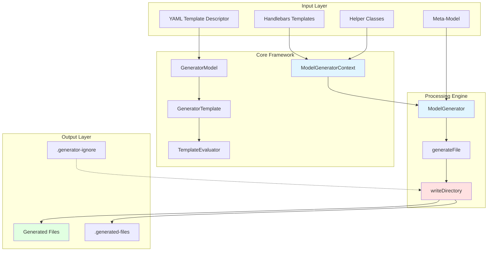
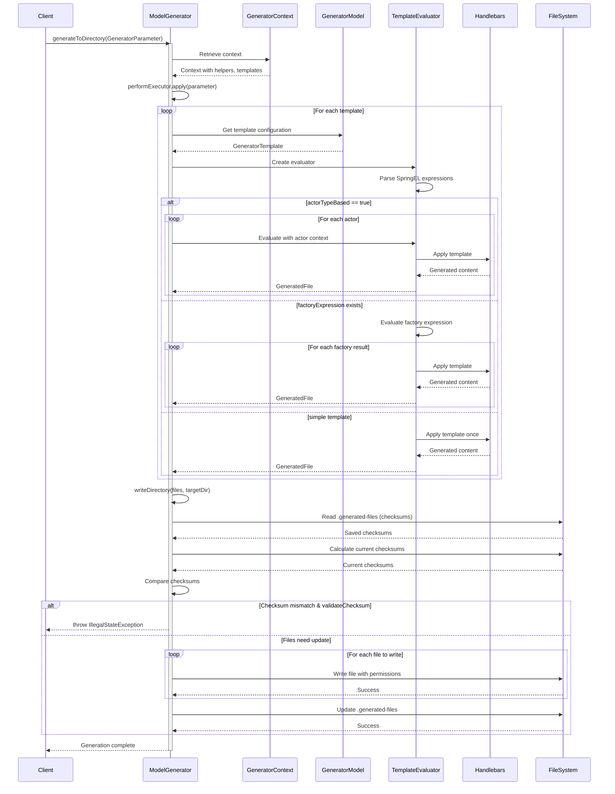
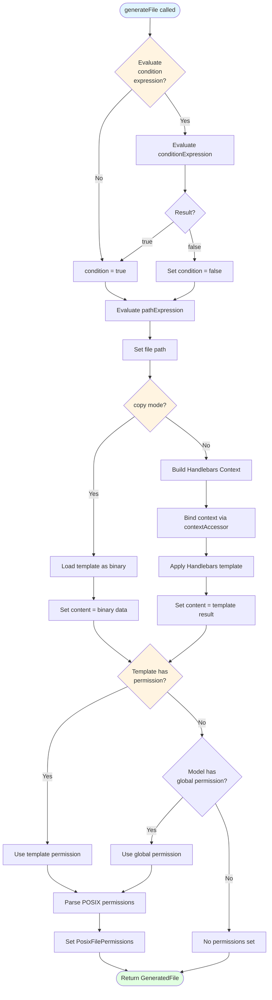
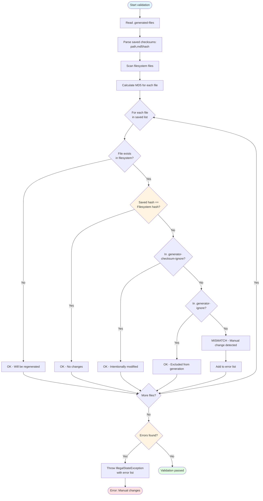

# JUDO Generator Commons


## Table of Contents

- [Overview](#overview)
- [Getting Started](#getting-started)
- [Template Configuration](#template-configuration)
- [Handlebars Templates](#handlebars-templates)
- [Helper Classes](#helper-classes)
- [Checksum Validation](#checksum-validation)
- [Generator Ignore Patterns](#generator-ignore-patterns)
- [File Permissions](#file-permissions)
- [Template Overrides](#template-overrides)
- [Advanced Features](#advanced-features)
- [Troubleshooting](#troubleshooting)
- [API Reference](#api-reference)
- [Best Practices](#best-practices)
- [Examples](#examples)
- [Contributing](#contributing)
- [License](#license)
- [Resources](#resources)

## Overview

**JUDO Generator Commons** is a powerful, template-based code generation framework for Java. It enables developers to transform meta-models into production-ready code using Handlebars templates combined with Spring Expression Language (SpringEL).

This framework provides the foundation for building custom code generators with enterprise-grade features like:

* ✅ **Checksum validation** - Protect against accidental overwrites
* ✅ **Incremental generation** - Only regenerate changed files
* ✅ **Flexible ignore patterns** - Customize file exclusions
* ✅ **POSIX permissions** - Control generated file permissions
* ✅ **Actor-based generation** - Generate files per domain entity
* ✅ **Template inheritance** - Override templates easily

### Quick Facts

| | |
|---|---|
| **Technology** | Java 21, Maven, OSGi Bundle |
| **License** | Eclipse Public License 2.0 |
| **Template Engine** | Handlebars.java 4.4.0 |
| **Expression Language** | Spring Expression Language 6.2.7 |
| **Repository** | https://github.com/BlackBeltTechnology/judo-generator-commons |

### Who Uses This?

JUDO Generator Commons is used by the following meta-model projects:

* [**judo-meta-esm**](https://github.com/BlackBeltTechnology/judo-meta-esm) - Entity State Machine generator
* [**judo-meta-pam**](https://github.com/BlackBeltTechnology/judo-meta-pam) - Platform Abstract Model generator
* [**judo-meta-ui**](https://github.com/BlackBeltTechnology/judo-meta-ui) - User Interface generator

Each meta-model project contains three modules that work with Generator Commons:

| Module | Purpose |
|---|---|
| `generator-engine` | Binds the meta-model to the generator framework, configures generation process |
| `generator-maven-project` | Provides Maven plugin integration for build-time generation |
| `generator-maven-plugin-test` | Contains test projects and example configurations |

## Getting Started

### Prerequisites

* Java 21 or higher
* Maven 3.9.4 or higher
* Familiarity with Handlebars templates (optional but helpful)
* Basic understanding of Spring Expression Language (optional but helpful)

### Adding to Your Project

Add the following dependency to your `pom.xml`:

```xml
<dependency>
    <groupId>hu.blackbelt.judo.generator</groupId>
    <artifactId>judo-generator-commons</artifactId>
    <version>1.0.0-SNAPSHOT</version>
</dependency>
```

### Basic Usage Example

Here's a minimal example of using the generator:

```java
import hu.blackbelt.judo.generator.commons.*;

// 1. Create generator context
ModelGeneratorContext context = ModelGenerator.createGeneratorContext(
    templateLoader,
    urlResolver,
    generatorModel,
    helperClasses,
    valueResolvers,
    contextAccessor
);

// 2. Configure generation parameters
GeneratorParameter param = GeneratorParameter.builder()
    .generatorContext(context)
    .targetDirectory(new File("output/"))
    .performExecutor(this::executeGeneration)
    .validateChecksum(true)
    .build();

// 3. Generate files
ModelGenerator.generateToDirectory(param);
```

## Architecture & Generation Flow

This section provides detailed diagrams of the generation workflow and key functions.

### High-Level Architecture



### Complete Generation Workflow



### generateFile() Function Flow



### writeDirectory() Function Flow

```mermaid
flowchart TD
    Start([writeDirectory called]) --> Filter[Filter files by condition]
    
    Filter --> InitIgnore[Initialize GeneratorIgnore<br/>& ChecksumIgnore]
    
    InitIgnore --> CalcNew[Calculate checksums<br/>for new files]
    CalcNew --> ReadSaved[Read saved .generated-files]
    ReadSaved --> ReadFS[Read filesystem checksums]
    
    ReadFS --> CreateMaps[Create Map objects:<br/>- generatorFileMap<br/>- savedFileMap<br/>- filesystemFileMap]
    
    CreateMaps --> DeleteOld{Files in filesystem<br/>but not in generator?}
    
    DeleteOld -->|Yes| CheckIgnoreDel{In .generator-ignore?}
    DeleteOld -->|No| Validate
    
    CheckIgnoreDel -->|No| DeleteFile[Delete file]
    CheckIgnoreDel -->|Yes| KeepFile1[Keep file]
    
    DeleteFile --> Validate{validateChecksum<br/>enabled?}
    KeepFile1 --> Validate
    
    Validate -->|Yes| CheckMismatch{Checksum<br/>mismatch in<br/>filesystem?}
    Validate -->|No| PrepareWrite
    
    CheckMismatch -->|Yes| CheckCsumIgnore{In .generator-<br/>checksum-ignore?}
    CheckMismatch -->|No| PrepareWrite
    
    CheckCsumIgnore -->|No| CheckGenIgnore{In .generator-<br/>ignore?}
    CheckCsumIgnore -->|Yes| PrepareWrite
    
    CheckGenIgnore -->|No| ThrowError[Throw IllegalStateException:<br/>Manual changes detected]
    CheckGenIgnore -->|Yes| PrepareWrite[Prepare files to write]
    
    PrepareWrite --> FilterWrite{Need to write?<br/>- Not in filesystem<br/>- Not in saved<br/>- Checksum differs}
    
    FilterWrite -->|Yes| CheckIgnoreWrite{In .generator-<br/>ignore?}
    FilterWrite -->|No| UpdateIndex
    
    CheckIgnoreWrite -->|No| WriteFile[Write file to filesystem]
    CheckIgnoreWrite -->|Yes| SkipFile[Skip writing]
    
    WriteFile --> SetPerm{Has<br/>permissions?}
    
    SetPerm -->|Yes| ApplyPOSIX[Apply POSIX permissions]
    SetPerm -->|No| NextFile
    
    ApplyPOSIX --> NextFile{More files?}
    SkipFile --> NextFile
    
    NextFile -->|Yes| FilterWrite
    NextFile -->|No| UpdateIndex[Update .generated-files<br/>with new checksums]
    
    UpdateIndex --> End([Complete])
    ThrowError --> ErrorEnd([Error: Manual changes])
    
    style Start fill:#e1f5ff
    style End fill:#e1ffe1
    style ErrorEnd fill:#ffe1e1
    style Validate fill:#fff4e1
    style CheckMismatch fill:#fff4e1
    style FilterWrite fill:#fff4e1
```



### Expression Evaluation Flow

```mermaid
flowchart TD
    Start([Expression in YAML]) --> ParseYAML[Parse YAML configuration]
    
    ParseYAML --> CreateTE[Create TemplateEvaluator]
    
    CreateTE --> ParseExpr[Parse SpringEL expressions]
    
    ParseExpr --> FactoryExpr{Has<br/>factoryExpression?}
    FactoryExpr -->|Yes| ParseFactory[Parse factory expression]
    FactoryExpr -->|No| PathExpr
    
    ParseFactory --> PathExpr{Has<br/>pathExpression?}
    PathExpr -->|Yes| ParsePath[Parse path expression]
    PathExpr -->|No| CondExpr
    
    ParsePath --> CondExpr{Has<br/>conditionExpression?}
    CondExpr -->|Yes| ParseCond[Parse condition expression]
    CondExpr -->|No| TmplCtx
    
    ParseCond --> TmplCtx{Has<br/>templateContext?}
    TmplCtx -->|Yes| ParseContext[Parse context expressions]
    TmplCtx -->|No| CreateCtx
    
    ParseContext --> CreateCtx[Create StandardEvaluationContext]
    
    CreateCtx --> SetVars[Set variables:<br/>- #self<br/>- #model<br/>- #actorType]
    
    SetVars --> RegHelpers[Register helper methods<br/>as SpringEL functions]
    
    RegHelpers --> EvalFactory{Evaluate<br/>factoryExpression?}
    
    EvalFactory -->|Yes| GetCollection[Get collection result]
    EvalFactory -->|No| EvalPath
    
    GetCollection --> LoopItems[Loop through items]
    LoopItems --> SetSelf[Set #self = current item]
    SetSelf --> EvalPath
    
    EvalPath[Evaluate pathExpression] --> GetPath[Get file path string]
    
    GetPath --> EvalCond{Evaluate<br/>conditionExpression?}
    
    EvalCond -->|Yes| GetBool[Get boolean result]
    EvalCond -->|No| BuildHBS
    
    GetBool --> CheckBool{Result<br/>== true?}
    CheckBool -->|Yes| BuildHBS
    CheckBool -->|No| SkipGen[Skip generation]
    
    BuildHBS[Build Handlebars Context] --> AddCtxVars[Add templateContext variables]
    
    AddCtxVars --> BindCtx[Bind context to ThreadLocal]
    
    BindCtx --> ApplyTmpl[Apply Handlebars template]
    
    ApplyTmpl --> Return([Return generated content])
    SkipGen --> Return
    
    style Start fill:#e1f5ff
    style Return fill:#e1ffe1
    style FactoryExpr fill:#fff4e1
    style PathExpr fill:#fff4e1
    style CondExpr fill:#fff4e1
    style TmplCtx fill:#fff4e1
```



### Helper Method Resolution

```mermaid
flowchart TD
    Start([Helper method called]) --> InTemplate{Called from<br/>template or<br/>SpringEL?}
    
    InTemplate -->|Template| HBS[Handlebars invocation]
    InTemplate -->|SpringEL| SPEL[SpringEL function call]
    
    HBS --> FindHelper[Find @TemplateHelper class]
    SPEL --> FindHelper
    
    FindHelper --> CheckCache{Method in<br/>cache?}
    
    CheckCache -->|Yes| GetCached[Get cached Method]
    CheckCache -->|No| ScanClass[Scan class for public static methods]
    
    ScanClass --> FilterSig[Filter by signature:<br/>- 0 or 1 parameter<br/>- Non-void return]
    
    FilterSig --> CacheMethod[Cache method reference]
    
    CacheMethod --> GetCached
    
    GetCached --> CheckParams{Method has<br/>parameter?}
    
    CheckParams -->|Yes| InvokeWithParam[Invoke with argument]
    CheckParams -->|No| InvokeNoParam[Invoke without argument]
    
    InvokeWithParam --> CheckContext{Has<br/>@ContextAccessor?}
    InvokeNoParam --> CheckContext
    
    CheckContext -->|Yes| BindTL[Bind context to ThreadLocal]
    CheckContext -->|No| Execute
    
    BindTL --> Execute[Execute method]
    
    Execute --> GetResult[Get return value]
    
    GetResult --> UnbindTL{Needs<br/>unbind?}
    
    UnbindTL -->|Yes| CleanTL[Clean ThreadLocal]
    UnbindTL -->|No| Return
    
    CleanTL --> Return([Return result])
    
    style Start fill:#e1f5ff
    style Return fill:#e1ffe1
    style InTemplate fill:#fff4e1
    style CheckCache fill:#fff4e1
    style CheckParams fill:#fff4e1
```

### Checksum Validation Flow



### Actor-Based Generation Flow

```mermaid
flowchart TD
    Start([Start generation]) --> CheckActorBased{Template has<br/>actorTypeBased=true?}
    
    CheckActorBased -->|No| NormalFlow[Normal single generation]
    CheckActorBased -->|Yes| GetActors[Get all actor types from model]
    
    GetActors --> FilterActors[Apply actorTypePredicate filter]
    
    FilterActors --> LoopActors{For each<br/>actor type}
    
    LoopActors --> SetActorCtx[Set context:<br/>- #actorType = current actor<br/>- #self = current actor]
    
    SetActorCtx --> EvalGuard{Has context<br/>guard?}
    
    EvalGuard -->|Yes| CheckGuard{Guard<br/>passes?}
    EvalGuard -->|No| EvalConstraints
    
    CheckGuard -->|No| SkipActor[Skip all constraints for actor]
    CheckGuard -->|Yes| EvalConstraints
    
    EvalConstraints --> LoopTemplates{For each<br/>template}
    
    LoopTemplates --> HasTmplGuard{Has template<br/>guard?}
    
    HasTmplGuard -->|Yes| CheckTmplGuard{Guard<br/>passes?}
    HasTmplGuard -->|No| GenFile
    
    CheckTmplGuard -->|No| SkipTemplate[Skip template]
    CheckTmplGuard -->|Yes| GenFile[Generate file]
    
    GenFile --> ResolveDir[Resolve target directory:<br/>actorTypeTargetDirectoryResolver]
    
    ResolveDir --> AddToResult[Add to GeneratorResult<br/>generatedByDiscriminator[actor]]
    
    AddToResult --> NextTemplate{More templates?}
    SkipTemplate --> NextTemplate
    
    NextTemplate -->|Yes| LoopTemplates
    NextTemplate -->|No| NextActor{More actors?}
    
    SkipActor --> NextActor
    NextActor -->|Yes| LoopActors
    NextActor -->|No| WriteActorFiles
    
    WriteActorFiles --> LoopActorResults{For each actor<br/>result}
    
    LoopActorResults --> WriteActorDir[Write to actor directory:<br/>.generated-files-[actorName]]
    
    WriteActorDir --> NextActorResult{More actor<br/>results?}
    
    NextActorResult -->|Yes| LoopActorResults
    NextActorResult -->|No| End
    
    NormalFlow --> WriteCommon[Write to common directory:<br/>.generated-files]
    
    WriteCommon --> End([Complete])
    
    style Start fill:#e1f5ff
    style End fill:#e1ffe1
    style CheckActorBased fill:#fff4e1
    style EvalGuard fill:#fff4e1
    style HasTmplGuard fill:#fff4e1
```

### Key Architecture Components

| Component | Responsibility | Key Methods |
|---|---|---|
| `ModelGenerator` | Central orchestrator for generation workflow | `generateToDirectory()`, `writeDirectory()`, `generateFile()` |
| `ModelGeneratorContext` | State management and engine configuration | `createHandlebars()`, `createSpringEvaluationContext()` |
| `GeneratorModel` | Template collection loaded from YAML | `loadYamlURL()`, `overrideTemplates()` |
| `GeneratorTemplate` | Single template configuration with expressions | `evalToContextBuilder()` |
| `TemplateEvaluator` | Evaluates SpringEL expressions and applies templates | `getFactoryExpressionResultOrValue()` |
| `GeneratorIgnore` | GLOB-based file exclusion | `shouldExcludeFile()` |
| `ChecksumUtil` | MD5 checksum calculation | `getMD5()` |
| `GitIgnoreSynchronizer` | Maintains .gitignore with generated files | `addGeneratedFiles()` |

## Template Configuration

### YAML Descriptor Structure

Template configurations are defined in YAML files (e.g., `project.yaml`). Here's a typical structure:

```yaml
# Optional global permission for all templates
permission: rwxr-xr-x

# Optional global template context variables
templateContext:
  - name: projectName
    expression: "#model.name"

templates:
  - name: entityClass                                    # 1
    pathExpression: "#actorType.name + '.java'"          # 2
    templateName: templates/Entity.java.hbs              # 3
    actorTypeBased: true                                 # 4
    conditionExpression: "#actorType.isPublic()"         # 5
    permission: rw-r--r--                                # 6
    
  - name: serviceInterface
    pathExpression: "'services/' + #model.name + 'Service.java'"
    templateName: templates/Service.java.hbs
    factoryExpression: "#model.getAllServices()"         # 7
    templateContext:                                     # 8
      - name: version
        expression: "'1.0.0'"
```

**Annotations:**
1. Unique identifier for this template (used for overrides)
2. SpringEL expression defining the output file path
3. Path to the Handlebars template file
4. When `true`, template is called for each actor type
5. Optional condition - skip generation if evaluates to `false`
6. POSIX file permissions (owner, group, other)
7. Expression returning a collection to iterate over
8. Additional variables available in the template

### Template Properties Reference

| Property | Type | Required | Description |
|---|---|---|---|
| `name` | String | ✅ Yes | Unique template identifier. Used for template overrides. |
| `pathExpression` | SpringEL | ✅ Yes | Expression that evaluates to the output file path (relative to target directory). |
| `templateName` | String | No | Path to the Handlebars template file (relative to template root). Omit for inline templates. |
| `actorTypeBased` | Boolean | No | If `true`, the template is called for each actor type. Default: `false`. |
| `factoryExpression` | SpringEL | No | Expression returning a collection. Template is called once per element. |
| `conditionExpression` | SpringEL | No | Boolean expression. Generation is skipped if evaluates to `false`. |
| `templateContext` | List | No | Additional variables to make available in the template. |
| `permission` | String | No | POSIX permissions in format `rwxrwxrwx` (owner, group, other). Overrides global permission. |
| `copy` | Boolean | No | If `true`, treats template as binary file (no templating applied). Default: `false`. |
| `exclude` | Boolean | No | If `true`, excludes this template from generation (used in overrides). Default: `false`. |

### Expression Language (SpringEL)

All expressions in YAML use [Spring Expression Language (SpringEL)](https://docs.spring.io/spring-framework/docs/current/reference/html/core.html#expressions).

#### Available Variables

The following variables are available in expressions:

| Variable | Description |
|---|---|
| `#self` | Context-dependent: actor type (if `actorTypeBased=true`), current iteration element (in `factoryExpression`), or the model (otherwise) |
| `#model` | The model object passed to the generator |
| `#actorType` | Current actor type (only available when `actorTypeBased=true`) |
| Helper methods | Any public static method in `@TemplateHelper` classes, prefixed with `#` |

#### Expression Examples

```yaml
# Simple property access
pathExpression: "#actorType.name + '.java'"

# Method calls
pathExpression: "#actorType.getPackagePath() + '/' + #actorType.name + '.java'"

# String concatenation
pathExpression: "'generated/' + #model.name + '/Config.java'"

# Conditional (ternary) operator
pathExpression: "#actorType.isPublic() ? 'public/' : 'internal/' + #actorType.name + '.java'"

# Helper method usage
pathExpression: "#upperCase(#actorType.name) + '.java'"

# Collection operations
factoryExpression: "#model.entities.?[public == true]"  # Filter
conditionExpression: "#actorType.methods.size() > 0"    # Size check
```

#### Understanding `#self`

The meaning of `#self` depends on context:

| Context | `#self` refers to |
|---|---|
| `actorTypeBased=true` | The current actor type being processed |
| Inside `factoryExpression` iteration | The current element from the collection |
| Neither of above | The model object |

## Handlebars Templates

### Template Basics

Templates use [Handlebars.java](https://github.com/jknack/handlebars.java) syntax:

```handlebars
// Entity.java.hbs
package {{packageName}};

/**
 * Generated entity class for {{name}}
 */
public class {{name}} {
    
    {{#each properties}}
    private {{type}} {{name}};
    {{/each}}
    
    {{#each properties}}
    public {{type}} get{{capitalize name}}() {
        return {{name}};
    }
    
    public void set{{capitalize name}}({{type}} {{name}}) {
        this.{{name}} = {{name}};
    }
    {{/each}}
}
```

### Using Helper Methods

Helper methods extend template functionality:

```handlebars
{{! Using string helpers }}
Class name: {{upperCase className}}
Table name: {{camelCaseToSnakeCase tableName}}

{{! Using custom helpers }}
{{#if (isPublic actorType)}}
public class {{name}} { ... }
{{else}}
/* package-private */ class {{name}} { ... }
{{/if}}
```

### Template Context Variables

Variables from `templateContext` are directly accessible:

**YAML Configuration:**
```yaml
templates:
  - name: config
    templateName: config.hbs
    templateContext:
      - name: appVersion
        expression: "'2.0.0'"
      - name: buildDate
        expression: "T(java.time.LocalDate).now()"
```

**Template:**
```handlebars
// config.hbs
Application Version: {{appVersion}}
Build Date: {{buildDate}}
```

## Helper Classes

Helper classes provide reusable logic for templates and expressions.

### Creating a Helper Class

```java
import hu.blackbelt.judo.generator.commons.StaticMethodValueResolver;
import hu.blackbelt.judo.generator.commons.annotations.TemplateHelper;

@TemplateHelper  // 1
public class StringHelper extends StaticMethodValueResolver {  // 2
    
    // 3
    public static String upperCase(Object obj) {
        return obj != null ? obj.toString().toUpperCase() : "";
    }
    
    public static String camelCaseToSnakeCase(Object obj) {
        if (obj == null) return "";
        return CaseFormat.LOWER_CAMEL.to(
            CaseFormat.LOWER_UNDERSCORE, 
            obj.toString()
        );
    }
    
    public static boolean isEmpty(Object obj) {
        if (obj == null) return true;
        if (obj instanceof String) return ((String) obj).isEmpty();
        if (obj instanceof Collection) return ((Collection<?>) obj).isEmpty();
        return false;
    }
}
```

**Annotations:**
1. Mark the class with `@TemplateHelper` for automatic discovery
2. Extend `StaticMethodValueResolver` for enhanced method resolution
3. Helper methods **must** be `public static`

### Helper Method Requirements

| Requirement | Description |
|---|---|
| **Visibility** | Must be `public static` |
| **Parameters** | Maximum 1 parameter (or 0 parameters) |
| **Return Type** | Must return a value (non-void) |
| **Class Annotation** | Class must have `@TemplateHelper` annotation |

### Using Helpers in Templates

```handlebars
{{! Direct method call }}
{{upperCase actorType.name}}

{{! Method as parameter }}
{{#if (isEmpty properties)}}
No properties defined.
{{/if}}

{{! Chained calls }}
{{upperCase (camelCaseToSnakeCase tableName)}}
```

### Using Helpers in SpringEL

```yaml
templates:
  - name: entity
    pathExpression: "#upperCase(#actorType.name) + '.java'"
    conditionExpression: "!#isEmpty(#actorType.properties)"
```

### Accessing Template Parameters

For helpers that need access to template parameters (e.g., configuration values):

```java
import hu.blackbelt.judo.generator.commons.ThreadLocalContextHolder;
import hu.blackbelt.judo.generator.commons.annotations.ContextAccessor;
import hu.blackbelt.judo.generator.commons.annotations.TemplateHelper;

@TemplateHelper
@ContextAccessor  // 1
public class ConfigHelper extends StaticMethodValueResolver {
    
    // 2
    public static void bindContext(Map<String, ?> context) {
        ThreadLocalContextHolder.bindContext(context);
    }
    
    // 3
    public static synchronized String getApiPrefix(Object obj) {
        return (String) ThreadLocalContextHolder.getVariable("apiPrefix");
    }
    
    public static synchronized boolean isDebugMode(Object obj) {
        String debug = (String) ThreadLocalContextHolder.getVariable("debugMode");
        return Boolean.parseBoolean(debug);
    }
}
```

**Annotations:**
1. Add `@ContextAccessor` annotation
2. Implement `bindContext` method for framework integration
3. Use `synchronized` and `ThreadLocalContextHolder` for thread-safe parameter access

> **⚠️ Important:** This pattern is required when helper methods need to access template parameters during parallel builds. Without `ThreadLocal`, you may encounter race conditions.

## Checksum Validation

The generator uses MD5 checksums to protect against accidental file overwrites and enable incremental generation.

### How It Works

1. **Generation**: When files are generated, their MD5 checksums are calculated and stored
2. **Storage**: Checksums are saved in index files:
   - `.generated-files` - For non-actor-based templates
   - `.generated-files-[actor]` - For actor-based templates (one per actor)
3. **Validation**: On subsequent generations, current file checksums are compared against stored checksums
4. **Protection**: If a file has been manually modified (checksum mismatch), generation fails with an error

### Checksum Index Format

Each line in the index file contains a file path and its MD5 checksum:

```
src/main/java/com/example/User.java,5d41402abc4b2a76b9719d911017c592
src/main/java/com/example/Order.java,7d793037a0760186574b0282f2f435e7
src/main/resources/config.properties,098f6bcd4621d373cade4e832627b4f6
```

### Handling Modified Files

If you encounter the error: **"Generated file have been modified, please revert or delete it or add to generator-ignore"**

You have three options:

| Option | When to Use | How |
|---|---|---|
| **Revert** | You want to discard manual changes | `git checkout -- path/to/file.java` |
| **Delete** | You want the file regenerated | `rm path/to/file.java` then re-run generator |
| **Ignore** | You want to keep manual changes permanently | Add to `.generator-ignore` (see below) |

### Incremental Generation

The checksum system enables intelligent incremental generation:

* ✅ **Unchanged files**: If checksum matches, file is not rewritten (helps incremental compilers)
* ✅ **Modified files**: Only files with content changes are written
* ✅ **Deleted templates**: Files removed from templates are automatically deleted from filesystem

### Resetting Checksums

To reset all checksums (useful for debugging or fresh starts):

```java
ModelGenerator.resetChecksums(targetDirectory, discriminators);
```

Or delete the index files manually:

```bash
rm .generated-files*
```

## Generator Ignore Patterns

The `.generator-ignore` file allows you to exclude files from generation, enabling you to maintain custom modifications.

### Format

Uses GLOB patterns, same syntax as `.gitignore`:

```
# Ignore specific files
src/main/java/com/example/CustomUser.java
src/main/resources/custom-config.xml

# Ignore by extension
*.log
*.tmp
**/*.backup

# Ignore directories
target/
build/
temp/

# Ignore all files in directory
generated/*

# Exception: don't ignore specific file
!generated/important.txt

# Pattern matching
*_backup
test_*.java

# Path-based
/bin/                    # Only bin at project root
docs/**/*.md            # All .md files in docs and subdirectories
src/*.init              # .init files directly in src
```

### How It Works

1. **Hierarchy**: `.generator-ignore` files can exist at any directory level
2. **Inheritance**: Patterns are combined from all parent directories
3. **Index**: Ignored files still appear in `.generated-files` index
4. **Checksums**: Checksum validation still performed, but writing is skipped
5. **Responsibility**: Once ignored, maintaining the file is **your responsibility**

### Example Use Cases

| Use Case | Pattern | Explanation |
|---|---|---|
| Customize generated entity | `src/main/java/User.java` | Ignore specific file, keep your modifications |
| Protect all configuration files | `**/*-config.xml` | Ignore all files ending with `-config.xml` anywhere |
| Exclude test resources | `src/test/resources/**` | Don't regenerate anything in test resources |
| Keep manual scripts | `scripts/*.sh` | Protect shell scripts from regeneration |
| Exclude entire module | `legacy-module/` | Don't touch anything in legacy-module directory |

### Checksum Ignore

For cases where you want to **allow overwriting** manually modified files, use `.generator-checksum-ignore`:

```
# Allow overwriting these files even if manually modified
src/main/java/AutoUpdatedConfig.java
version.properties
```

The difference:

| File | `.generator-ignore` | `.generator-checksum-ignore` |
|---|---|---|
| **Purpose** | Prevent file from being generated | Allow overwriting modified file |
| **Generation** | File is NOT written | File IS written (overwrites manual changes) |
| **Use Case** | Permanent manual modifications | Temporary manual modifications that should be overwritten |

## File Permissions

The generator can set POSIX file permissions on generated files.

### Permission Format

Uses standard POSIX notation: `rwxrwxrwx`

```
rwx rwx rwx
│   │   └── Other (all users)
│   └────── Group
└────────── Owner

r = read    (4)
w = write   (2)
x = execute (1)
- = no permission
```

### Setting Permissions

#### Global Permission

Applies to all templates:

```yaml
permission: rw-r--r--  # Owner: rw, Group: r, Other: r

templates:
  - name: script
    templateName: script.sh.hbs
    # Inherits global permission
```

#### Template-Level Permission

Overrides global permission for specific template:

```yaml
permission: rw-r--r--  # Global: read-only for group/other

templates:
  - name: executable
    templateName: start.sh.hbs
    permission: rwxr-xr-x  # Override: make executable
    
  - name: secret
    templateName: secrets.txt.hbs
    permission: rw-------  # Override: owner-only access
```

### Common Permission Patterns

| Permission | Notation | Use Case |
|---|---|---|
| `rwxr-xr-x` | 755 | Executable scripts, public programs |
| `rw-r--r--` | 644 | Regular source files, documentation |
| `rw-rw-r--` | 664 | Shared project files |
| `rwx------` | 700 | Private executables |
| `rw-------` | 600 | Secrets, private configuration |
| `rwxrwxrwx` | 777 | ⚠️ Public write access (avoid in production) |

### Example

```yaml
# Global: standard source file permissions
permission: rw-r--r--

templates:
  # Regular Java class - uses global permission
  - name: entity
    templateName: Entity.java.hbs
    pathExpression: "#actorType.name + '.java'"
    
  # Shell script - needs execute permission
  - name: startScript
    templateName: start.sh.hbs
    pathExpression: "'bin/start.sh'"
    permission: rwxr-xr-x
    
  # Database password file - owner-only access
  - name: dbPassword
    templateName: db-password.txt.hbs
    pathExpression: "'secrets/db-password.txt'"
    permission: rw-------
```

> **Note:** On non-POSIX systems (e.g., Windows), permission settings are gracefully ignored.

## Template Overrides

Template overrides allow you to customize generation behavior without modifying the base templates.

### How Overrides Work

1. **Base Templates**: Original templates in the base directory
2. **Override Templates**: Custom templates in override directory with `.override.hbs` extension
3. **Resolution**: Generator looks for override first, falls back to base

### Directory Structure

```
templates/
├── base/
│   ├── Entity.java.hbs              # Original template
│   ├── Service.java.hbs             # Original template
│   └── Controller.java.hbs          # Original template
│
└── overrides/
    ├── Entity.java.override.hbs     # Overrides Entity.java.hbs
    └── Service.java.override.hbs    # Overrides Service.java.hbs
    # Controller.java.hbs uses base (no override)
```

### Override Examples

#### Example 1: Customize Entity Template

**Base template** (`templates/base/Entity.java.hbs`):
```handlebars
public class {{name}} {
    // Base implementation
}
```

**Override template** (`templates/overrides/Entity.java.override.hbs`):
```handlebars
import lombok.Data;

@Data  // Add Lombok annotation
public class {{name}} {
    // Custom implementation with Lombok
}
```

#### Example 2: Exclude Template from Generation

In your override YAML:

```yaml
templates:
  - name: deprecatedTemplate
    exclude: true  # Don't generate this template
```

### Override Configuration

Override templates in YAML by name:

```yaml
# base-project.yaml
templates:
  - name: entityClass
    templateName: Entity.java.hbs
    pathExpression: "#actorType.name + '.java'"
    permission: rw-r--r--

---

# override-project.yaml
templates:
  - name: entityClass
    # Override path
    pathExpression: "'custom/' + #actorType.name + '.java'"
    # Override permission
    permission: rwxr-xr-x
    # Template file is automatically Entity.java.override.hbs
```

### Loading Overrides

```java
// Load base model
GeneratorModel baseModel = GeneratorModel.loadYamlURL(
    baseYamlUrl, 
    templateMixin
);

// Load override model
GeneratorModel overrideModel = GeneratorModel.loadYamlURL(
    overrideYamlUrl, 
    templateMixin
);

// Apply overrides
baseModel.overrideTemplates(overrideModel);
```

## Advanced Features

### Actor-Based Generation

Generate files per domain entity (actor):

```yaml
templates:
  - name: entityClass
    templateName: Entity.java.hbs
    pathExpression: "#actorType.name + '.java'"
    actorTypeBased: true  # Called once per actor type
```

In your generator parameter:

```java
GeneratorParameter param = GeneratorParameter.builder()
    .actorTypePredicate(actor -> actor.isPublic())  // Filter actors
    .actorTypeTargetDirectoryResolver(actor -> 
        new File("output/" + actor.getPackagePath())
    )
    .build();
```

### Factory Expressions

Generate multiple files from a single template:

```yaml
templates:
  - name: queryClass
    templateName: Query.java.hbs
    # Returns collection of queries
    factoryExpression: "#model.getAllQueries()"
    pathExpression: "'queries/' + #self.name + 'Query.java'"
```

Each element in the collection becomes `#self` in expressions.

### Conditional Generation

Skip generation based on conditions:

```yaml
templates:
  - name: publicApi
    templateName: PublicAPI.java.hbs
    # Only generate if actor is public
    conditionExpression: "#actorType.isPublic()"
    actorTypeBased: true
```

### Binary File Copy

Copy binary files without templating:

```yaml
templates:
  - name: logo
    templateName: images/logo.png  # Binary file
    pathExpression: "'static/logo.png'"
    copy: true  # No template processing
```

### GitIgnore Synchronization

Automatically maintain `.gitignore` with generated files:

```java
import hu.blackbelt.judo.generator.commons.GitIgnoreSynchronizer;

GitIgnoreSynchronizer synchronizer = new GitIgnoreSynchronizer(projectRoot);
synchronizer.addGeneratedFiles(generatedFileEntries);
```

This adds a managed block to `.gitignore`:

```
# JUDO GENERATOR BLOCK START
/generated/User.java
/generated/Order.java
/generated/Product.java
# JUDO GENERATOR BLOCK END
```

## Troubleshooting

### Common Issues

#### "Helper method not found"

**Symptom**: Template compilation error, method not recognized

**Solutions**:
* ✅ Ensure class has `@TemplateHelper` annotation
* ✅ Verify method is `public static`
* ✅ Check method has 0 or 1 parameter
* ✅ Confirm helper class is in classpath

#### "Generated file have been modified"

**Symptom**: `IllegalStateException` during generation

**Solutions**:
* Revert changes: `git checkout -- file.java`
* Delete file: `rm file.java`
* Add to `.generator-ignore` to keep changes
* Add to `.generator-checksum-ignore` to allow overwrite

#### "Template override not applied"

**Symptom**: Base template used instead of override

**Solutions**:
* ✅ Check file name ends with `.override.hbs`
* ✅ Verify file is in override directory
* ✅ Ensure template names match in YAML
* ✅ Confirm override model is loaded and applied

#### "Expression evaluation fails"

**Symptom**: `SpelEvaluationException` during generation

**Solutions**:
* ✅ Check SpringEL syntax (property access, method calls)
* ✅ Verify variable exists in context (`#model`, `#actorType`, `#self`)
* ✅ Ensure helper method is registered
* ✅ Test expression in isolation

#### "Permissions not applied"

**Symptom**: Generated files have wrong permissions

**Solutions**:
* ✅ Check permission format: `rwxrwxrwx` (not `755`)
* ✅ Verify POSIX filesystem (won't work on Windows)
* ✅ Confirm template permission overrides global permission
* ✅ Check file wasn't modified externally after generation

#### "Parallel build issues"

**Symptom**: Inconsistent results, race conditions

**Solutions**:
* ✅ Use `@ContextAccessor` annotation
* ✅ Implement `bindContext(Map)` method
* ✅ Access parameters via `ThreadLocalContextHolder`
* ✅ Mark helper methods `synchronized`

### Debug Mode

Enable debug logging in `logback.xml` or `logback-test.xml`:

```xml
<configuration>
    <logger name="hu.blackbelt.judo.generator" level="DEBUG"/>
    
    <root level="INFO">
        <appender-ref ref="STDOUT"/>
    </root>
</configuration>
```

### Validation Checklist

Before reporting issues, verify:

- [ ] Java 21 or higher installed
- [ ] Maven 3.9.4 or higher
- [ ] YAML syntax is valid
- [ ] Template files exist at specified paths
- [ ] Helper classes are on classpath
- [ ] Expression syntax is correct (SpringEL)
- [ ] File permissions are POSIX format
- [ ] Override files use `.override.hbs` extension
- [ ] Checksum index files are not corrupted

## API Reference

### Core Classes

| Class | Description |
|---|---|
| `ModelGenerator` | Main entry point for generation. Static methods for generating files, managing checksums. |
| `ModelGeneratorContext` | Container for generator state, Handlebars engine, SpringEL context, helpers. |
| `GeneratorModel` | Represents template collection loaded from YAML. |
| `GeneratorParameter` | Configuration for generation process (builder pattern). |
| `GeneratorTemplate` | Single template configuration with expressions. |
| `TemplateEvaulator` | Evaluates SpringEL expressions and applies Handlebars templates. |

### Key Methods

#### ModelGenerator

```java
// Generate files to directory
public static void generateToDirectory(GeneratorParameter parameter)

// Reset all checksums
public static void resetChecksums(File targetDirectory, Collection<?> discriminators)

// Recalculate checksums without regenerating
public static void recalculateChecksumToDirectory(
    File targetDirectory,
    Collection<?> discriminators,
    Collection<GeneratedFile> generatedFiles
)

// Clean files based on checksums
public static void cleanGeneratedFromChecksum(
    File targetDirectory,
    Collection<?> discriminators
)

// Get generated files as ZIP
public static byte[] getGeneratedFilesAsZip(
    Collection<GeneratedFile> generatedFiles
)
```

#### GeneratorModel

```java
// Load from YAML URL
public static GeneratorModel loadYamlURL(URL url, Class<?> mixin)

// Apply template overrides
public void overrideTemplates(GeneratorModel override)

// Builder pattern
public static GeneratorModelBuilder generatorModelBuilder()
```

#### GeneratorParameter.Builder

```java
GeneratorParameter param = GeneratorParameter.builder()
    .generatorContext(context)                    // Required
    .targetDirectory(new File("output/"))         // Optional
    .performExecutor(this::performGeneration)     // Optional
    .validateChecksum(true)                        // Optional, default: true
    .build();
```

### Annotations

| Annotation | Usage |
|---|---|
| `@TemplateHelper` | Mark helper class for automatic discovery |
| `@ContextAccessor` | Enable template parameter access via ThreadLocal |

### Utility Classes

| Class | Description |
|---|---|
| `ChecksumUtil` | MD5 checksum calculation |
| `GeneratorIgnore` | GLOB-based file exclusion |
| `ChecksumIgnore` | Checksum validation override |
| `GitIgnoreSynchronizer` | Maintain `.gitignore` with generated files |
| `ThreadLocalContextHolder` | Thread-safe parameter access for helpers |
| `StringHelper` | Built-in string manipulation helpers |
| `UriHelper` | URI manipulation utilities |

## Best Practices

### Template Design

* ✅ **Keep templates simple**: One responsibility per template
* ✅ **Use helpers**: Extract complex logic into helper methods
* ✅ **Add comments**: Document template intent and variables
* ✅ **Test incrementally**: Generate and verify output frequently
* ✅ **Version templates**: Track template changes in version control

### Helper Classes

* ✅ **Single responsibility**: One helper class per domain (strings, dates, formatting)
* ✅ **Null safety**: Always check for null inputs
* ✅ **Documentation**: Add Javadoc for helper methods
* ✅ **Unit tests**: Test helpers independently
* ✅ **Extend StaticMethodValueResolver**: Better method caching and resolution

### Expression Design

* ✅ **Keep expressions simple**: Complex logic belongs in helpers
* ✅ **Avoid side effects**: Expressions should be pure (no mutations)
* ✅ **Use meaningful names**: Clear variable and method names
* ✅ **Test expressions**: Verify in isolation before full generation
* ✅ **Document complex expressions**: Add YAML comments

### File Organization

* ✅ **Consistent structure**: Organize templates by feature/module
* ✅ **Naming conventions**: Use clear, descriptive template names
* ✅ **Separate concerns**: Base vs. override directories
* ✅ **Version YAML**: Track configuration changes
* ✅ **Document overrides**: Explain why overrides exist

### Generation Strategy

* ✅ **Start small**: Begin with one template, add gradually
* ✅ **Use checksums**: Enable validation to prevent accidents
* ✅ **Incremental generation**: Leverage checksum-based skipping
* ✅ **Proper ignores**: Use `.generator-ignore` for manual files
* ✅ **Clean builds**: Provide way to regenerate everything

### Performance

* ✅ **Cache helpers**: Extend `StaticMethodValueResolver`
* ✅ **Optimize expressions**: Avoid repeated expensive calls
* ✅ **Parallel generation**: Framework handles concurrency
* ✅ **Incremental updates**: Only regenerate changed files
* ✅ **Profile if needed**: Use logging to identify bottlenecks

## Examples

### Complete Example: REST API Generator

This example generates a complete REST API from a domain model.

#### Project Structure

```
my-generator/
├── src/main/
│   ├── java/
│   │   └── com/example/generator/
│   │       ├── MyGenerator.java
│   │       ├── MyGeneratorParameter.java
│   │       └── helpers/
│   │           ├── RestHelper.java
│   │           └── ValidationHelper.java
│   └── resources/
│       ├── templates/
│       │   ├── Entity.java.hbs
│       │   ├── Repository.java.hbs
│       │   ├── Service.java.hbs
│       │   └── Controller.java.hbs
│       └── project.yaml
```

#### Generator Class

```java
public class MyGenerator {
    
    public static void generate(MyGeneratorParameter param) {
        // Load templates
        URL templatesUrl = MyGenerator.class.getResource("/templates");
        URL yamlUrl = MyGenerator.class.getResource("/project.yaml");
        
        // Create template loader
        ChainedURLTemplateLoader templateLoader = 
            ChainedURLTemplateLoader.createFromURIs(
                List.of(templatesUrl.toURI())
            );
        
        // Load generator model
        GeneratorModel model = GeneratorModel.loadYamlURL(yamlUrl, null);
        
        // Find helpers
        Set<Class<?>> helpers = TemplateHelperFinder.collectHelpersAsClass(
            "com.example.generator.helpers"
        );
        
        // Create context
        ModelGeneratorContext context = ModelGenerator.createGeneratorContext(
            templateLoader,
            URLResolver.of(templatesUrl),
            model,
            helpers,
            Collections.emptySet(),
            null
        );
        
        // Configure generation
        GeneratorParameter genParam = GeneratorParameter.builder()
            .generatorContext(context)
            .targetDirectory(param.getTargetDirectory())
            .performExecutor(p -> performGeneration(p, param))
            .validateChecksum(true)
            .build();
        
        // Generate
        ModelGenerator.generateToDirectory(genParam);
    }
    
    private static GeneratorResult performGeneration(
        GeneratorParameter p, 
        MyGeneratorParameter param
    ) {
        GeneratorResult result = GeneratorResult.builder().build();
        
        // Generate files for each entity
        for (Entity entity : param.getModel().getEntities()) {
            Map<String, Object> context = Map.of(
                "model", param.getModel(),
                "entity", entity
            );
            
            result.getGenerated().addAll(
                generateFilesForEntity(p.getGeneratorContext(), entity, context)
            );
        }
        
        return result;
    }
}
```

#### YAML Configuration

```yaml
permission: rw-r--r--

templates:
  # Entity class
  - name: entity
    templateName: Entity.java.hbs
    pathExpression: "'entities/' + #entity.name + '.java'"
    
  # Repository interface
  - name: repository
    templateName: Repository.java.hbs
    pathExpression: "'repositories/' + #entity.name + 'Repository.java'"
    
  # Service class
  - name: service
    templateName: Service.java.hbs
    pathExpression: "'services/' + #entity.name + 'Service.java'"
    
  # REST Controller
  - name: controller
    templateName: Controller.java.hbs
    pathExpression: "'controllers/' + #entity.name + 'Controller.java'"
    conditionExpression: "#entity.hasRestApi()"
```

#### Helper Class

```java
@TemplateHelper
public class RestHelper extends StaticMethodValueResolver {
    
    public static String httpMethod(Object operation) {
        if (operation instanceof CreateOperation) return "POST";
        if (operation instanceof ReadOperation) return "GET";
        if (operation instanceof UpdateOperation) return "PUT";
        if (operation instanceof DeleteOperation) return "DELETE";
        return "GET";
    }
    
    public static String pathParam(Object property) {
        return "{" + property.toString() + "}";
    }
}
```

#### Template

```handlebars
// Controller.java.hbs
package {{packageName}}.controllers;

import org.springframework.web.bind.annotation.*;
import {{packageName}}.services.{{entity.name}}Service;

@RestController
@RequestMapping("/api/{{lowerCase entity.name}}s")
public class {{entity.name}}Controller {
    
    private final {{entity.name}}Service service;
    
    public {{entity.name}}Controller({{entity.name}}Service service) {
        this.service = service;
    }
    
    {{#each entity.operations}}
    @{{httpMethod this}}Mapping{{#if hasPathParams}}("{{pathExpression}}"){{/if}}
    public {{returnType}} {{name}}({{parameters}}) {
        return service.{{name}}({{parameterNames}});
    }
    {{/each}}
}
```

## Contributing

We welcome contributions! Please see [CONTRIBUTING.adoc](CONTRIBUTING.adoc) for guidelines.

### Development Setup

1. Clone the repository:
   ```bash
   git clone https://github.com/BlackBeltTechnology/judo-generator-commons.git
   cd judo-generator-commons
   ```

2. Build the project:
   ```bash
   mvn clean install
   ```

3. Run tests:
   ```bash
   mvn test
   ```

### Reporting Issues

Please report issues on [GitHub Issues](https://github.com/BlackBeltTechnology/judo-generator-commons/issues).

Include:

* Java version
* Maven version
* Full error message and stack trace
* Minimal reproducible example
* Expected vs. actual behavior

## License

This project is licensed under the Eclipse Public License 2.0. See [LICENSE.txt](LICENSE.txt) for details.

## Resources

### Documentation

* [AGENTS.md](AGENTS.md) - Comprehensive guide for AI assistants and developers
* [CONTRIBUTING.adoc](CONTRIBUTING.adoc) - Contribution guidelines
* [GitHub Repository](https://github.com/BlackBeltTechnology/judo-generator-commons)

### Related Projects

* [JUDO Meta ESM](https://github.com/BlackBeltTechnology/judo-meta-esm)
* [JUDO Meta PAM](https://github.com/BlackBeltTechnology/judo-meta-pam)
* [JUDO Meta UI](https://github.com/BlackBeltTechnology/judo-meta-ui)

### External Documentation

* [Handlebars.java Documentation](https://github.com/jknack/handlebars.java)
* [Spring Expression Language Reference](https://docs.spring.io/spring-framework/docs/current/reference/html/core.html#expressions)
* [Jackson YAML Documentation](https://github.com/FasterXML/jackson-dataformats-text)
* [Eclipse Public License 2.0](https://www.eclipse.org/legal/epl-2.0/)

## Support

For questions and support:

* 📧 Email: robert.csakany@blackbelt.hu
* 🐛 Issues: https://github.com/BlackBeltTechnology/judo-generator-commons/issues
* 🏢 Organization: http://www.blackbelt.hu

---

**Maintained by BlackBelt Technology** • **Version 1.0.0-SNAPSHOT** • **Last Updated: 2025-12-04**
